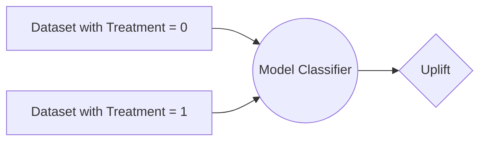
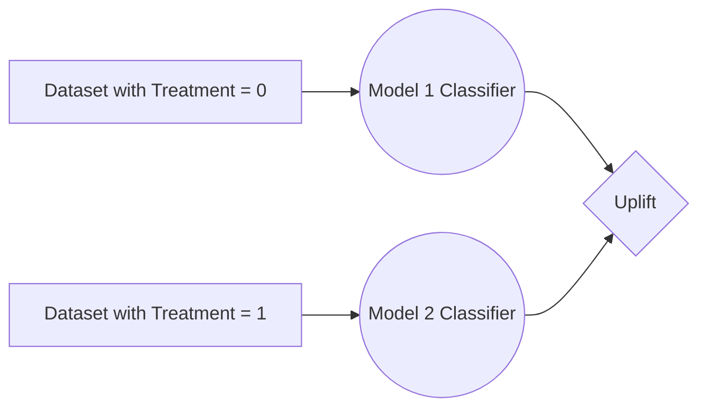

# Propensity-Uplift-Modeling

### In this exercise, we are going to evaluate CausalLift package for building an Uplift Model to help a Digital Marketer on the below two fronts:
- Increase Revenue by Improving Conversion Rates
- Reduce Costs by Reducing Cost Per Click

# What do we need to do?

### We need to identify the customers who are Persuadables and approach them with Digital Marketing Campaigns
- This will help us in running campaign operations in a much more efficient way with a very high conversion rate
### We need to avoid all the other 3 types of customers - Sure Things, Do Not Disturb and Lost Causes
- This will help us save unnecessary costs and hence improving the Cost Per Click

### One Model Process

### Two Model Process

If you are not able to view the UML diagrams, then please add this browser [plugin](https://github.com/BackMarket/github-mermaid-extension#install)

You can check out my other repositories here: [Github](https://github.com/rahul-adwani?tab=repositories)
You can contact me here: [LinkedIn](https://www.linkedin.com/in/rahuladwani/)
If you like the content, please give it a star

Thanks for reading,
Rahul Adwani
